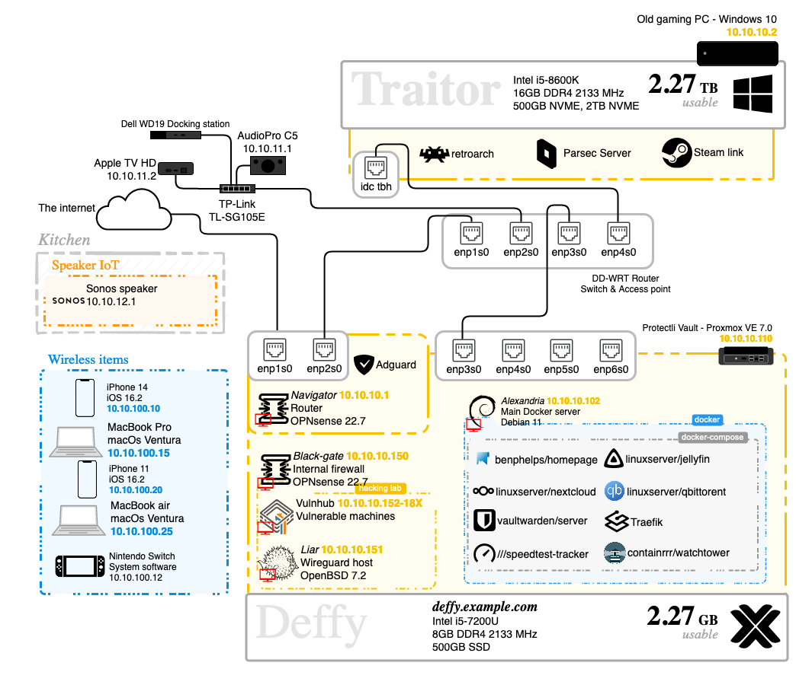

## Homelab
#### A collection of the services I run on my homelab

-

#### Future services

## ⇁  Disclaimer
Please note that although I use a torrent client on my server I do **NOT** pirate movies, games, or any other media. I find it morally wrong. I simply have a shared directory that I use to manage and seed linux ISOs for my Deffy server. I have a goal of eventually creating my own Linux distribution to help the ease of use for non-technical people so I want to have an easy way to manage multiple linux distributions for this goal. To learn more about this goal look at my future project [Arizona](https://github.com/21st-centuryman/arizona).

## ⇁  Welcome
This is a collection of the tools and services I use for my setup in my apartment. This is nothing crazy to me, but I was recommended by a colleague to set this up to illustrate my abilities around networks. I have everything set up in a docker compose file. I have yet to mess with kuberneties, but I might if I get a backup server. Once I stop being a broke college student.

## ⇁  Graph
Below is a graph of how I want this homelab to eventually look. The technologies at the top of this repo have been implemented. 
The ones that havent will be implemented when my time allows it:

