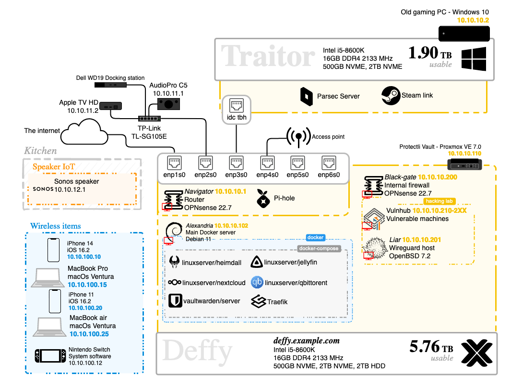

## Homelab
#### A collection of the services I run on my homelab

-

#### Future services

## ⇁  Welcome
This repo will be updated with time don't you worry :)

## ⇁  Graph
Below is a graph of how I want this homelab to eventually look. The technologies at the top of this repo have been implemented. 
The ones that havent will be implemented when my time allows it:

Note that there is a typo in the vulnhub machines and I need to rethink how I will set up my hacking lab
