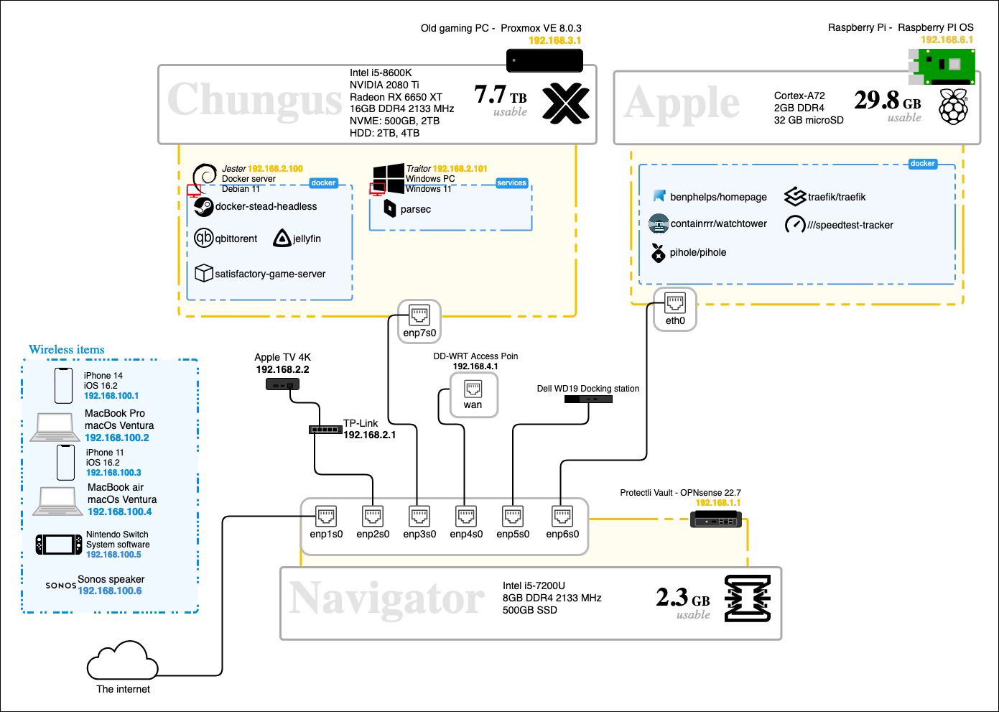

## Homelab
#### A collection of the services I run on my homelab

-

## ⇁  Welcome
This is a collection of the tools and services I use for my setup in my apartment. This is nothing crazy to me, but I was recommended by a past colleague to set this up to illustrate my abilities around networks. I have everything set up in a docker compose file. I have yet to mess with kuberneties, but I might if I get a second server. Or I stop being a broke college student.

## ⇁  Graph
Below is a graph of how I want this homelab to eventually look. 
For future features check the icons in this repo

